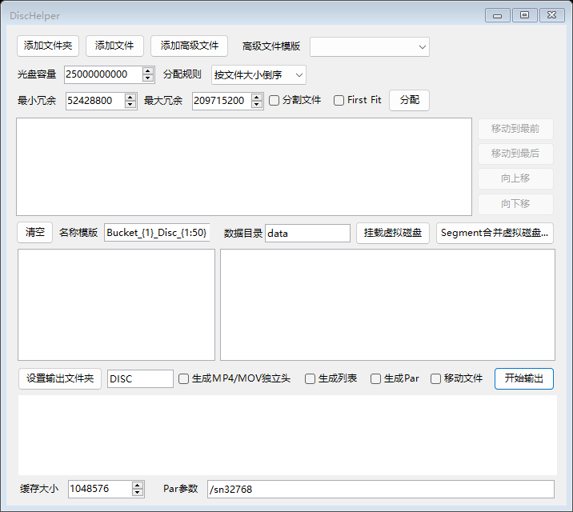

# DiscHelper 光盘文件分配工具

DiscHelper 可以帮你把一批文件安排到多张光盘中，并自动输出对应的文件夹。它适合整理大文件、备份文件，或者把文件分成多个部分后保存到不同光盘。



## 能做什么

- 添加文件，也可以一次添加整个文件夹。
- 按文件大小、文件名、创建时间等方式安排文件顺序。
- 把文件分配到多张光盘，并自动计算每张光盘还剩多少空间。
- 需要时把一个大文件分成多个 Segment 文件。
- 生成每张光盘的文件清单。
- 使用 Par2 生成校验和恢复数据，帮助检查或修复损坏的文件。
- 把多个文件交给外部命令处理，生成一个新的“高级文件”。
- 保存当前工作内容，下次打开软件时继续使用。

## 基本用法

### 1. 添加文件

点击“添加文件”选择文件，或者点击“添加文件夹”选择文件夹。

上方的文件列表就是待分配的文件。可以按住 `Ctrl` 或 `Shift` 选择多个文件，再使用右侧按钮调整顺序：

- 移动到最前
- 移动到最后
- 向上移
- 向下移

列表越靠前的文件，分配时越早处理。

### 2. 设置光盘并分配

在“光盘容量”中填写单张光盘的容量，然后点击“分配”。软件会生成光盘列表，例如：

```text
Bucket_1_Disc_1
Bucket_1_Disc_2
Bucket_1_Disc_3
```

光盘名称可以在列表中修改，也可以在“名称模板”中设置自动命名方式。没有选中的光盘时，后续操作默认使用全部光盘。

### 3. 输出文件

先点击“设置输出文件夹”选择保存位置，再点击“开始输出”。软件会在该位置生成每张光盘对应的文件夹。

常用选项包括：

- “分割文件”：把放不下的大文件切成多个 Segment。
- “移动文件”：条件允许时移动原文件，减少一次复制。
- “生成列表”：为每张光盘生成文件清单。
- “生成Par”：生成 Par2 校验和恢复文件。

分割后的文件名称类似：

```text
movie.mp4.Segment_01_of_03
movie.mp4.Segment_02_of_03
movie.mp4.Segment_03_of_03
```

## MP4/MOV 文件的播放头

如果需要以后在虚拟磁盘中直接打开 MP4/MOV，可以勾选“生成MP4/MOV独立头”。输出时，软件会在 Segment 所在文件夹中多生成两个小文件：

```text
movie.mp4.dhmp4.header
movie.mp4.dhmp4.xml
```

它们记录了 MP4 的文件结构和各个 Segment 的位置，不会再复制一份完整视频。原来的 Segment 文件仍然保留，之后可以通过“Segment合并虚拟磁盘...”把它们组合成一个看起来完整的 MP4 文件。

如果某个 Segment 从视频帧的中间开始，播放器可能无法从这一段开始播放。这是视频本身的限制，不代表原始文件损坏；完整 Segment 仍然可以按顺序恢复原文件。

## 虚拟磁盘

使用虚拟磁盘前需要安装 [WinFsp](https://winfsp.dev/)。安装完成后，软件会把文件显示成一个 Windows 磁盘盘符，通常是 `Z:`。

### 按光盘查看

点击“挂载虚拟磁盘”，可以看到和光盘列表一样的目录：

```text
Z:\
├── Bucket_1_Disc_1\
│   └── movie.mp4.Segment_01_of_03
└── Bucket_1_Disc_2\
    └── movie.mp4.Segment_02_of_03
```

这种方式不会合并 Segment，适合查看每张光盘中的实际内容。映射出来的文件是只读的，不会修改原文件。

这个功能的主要作用是省去“先把所有文件复制到光盘输出文件夹”这一步。挂载后，虚拟磁盘会按照已经分配好的光盘列表显示文件夹和文件，但文件内容仍然直接从原文件读取，不会在硬盘上另外生成一份相同的副本。

例如已经分配出 `Bucket_1_Disc_1` 和 `Bucket_1_Disc_2` 后，可以：

1. 点击“挂载虚拟磁盘”。
2. 在 Windows 资源管理器中打开新出现的虚拟磁盘，例如 `Z:`。
3. 打开 ImgBurn 或其它支持从文件夹刻录数据光盘的软件。
4. 将 `Z:\Bucket_1_Disc_1` 作为第一张光盘的来源进行刻录。
5. 第一张完成后，再将 `Z:\Bucket_1_Disc_2` 作为第二张光盘的来源。

这样刻录软件看到的是普通文件夹和文件，实际读取时 DiscHelper 会从原文件的对应位置提供数据。即使一个大文件被分到了多张光盘，也不需要提前在硬盘上复制出每个 Segment，因此可以减少临时空间占用和等待复制的时间。

刻录期间请保持 DiscHelper 和虚拟磁盘处于打开状态，也不要移动、重命名或删除原文件。建议等刻录软件完全结束并释放文件后再卸载虚拟磁盘；如果仍有程序正在读取，界面会显示活动“句柄”数量并在卸载时给出提示。

“数据目录”用于保存虚拟磁盘中新建的普通文件，默认是 `Settings.xml` 同目录下的 `data` 文件夹。普通文件可以在虚拟磁盘中创建、修改、删除和重命名。

### 合并 Segment 查看完整文件

点击“Segment合并虚拟磁盘...”，选择包含 Segment 的文件夹：

这个功能用于直接使用已经分割好的文件。通常要恢复一个被分成多个 Segment 的大文件，需要执行类似下面的命令：

```bat
copy /b file.Segment_01_of_03+file.Segment_02_of_03+file.Segment_03_of_03 file
```

这种做法会等待所有数据重新写入硬盘，并额外占用一份完整文件大小的空间。使用“Segment合并虚拟磁盘”则不需要执行 `copy /b`，也不需要先生成真实的完整文件。软件会把多个 Segment 按顺序显示成一个虚拟的完整文件；播放器、校验工具和其它程序可以像打开普通文件一样直接读取它。

例如文件夹中包含：

```text
movie.mkv.Segment_01_of_03
movie.mkv.Segment_02_of_03
movie.mkv.Segment_03_of_03
```

挂载后，虚拟磁盘中会显示：

```text
movie.mkv
```

当程序读取 `movie.mkv` 的不同位置时，DiscHelper 会自动从对应的 Segment 读取数据。读取跨越两个 Segment 的边界时也会自动衔接，因此不会要求播放器了解 Segment 的存在。原来的 Segment 不会被修改，也不会生成额外的完整副本。

- 同一个文件的多个 Segment 会显示成一个完整的文件。
- 有 `.dhmp4.xml` 的 MP4/MOV 会按照原来的位置组合。
- 如果中间某个 Segment 暂时不在文件夹中，该 Segment 原来占用的那一段位置会保留为空并读取为一串 `0`；后面的 Segment 仍从原来的位置开始，不会向前移动。例如缺少 `Segment_02` 时，`Segment_03` 不会紧接到 `Segment_01` 后面。
- 文件夹中的普通文件会直接显示出来。
- Segment 不完整或编号不连续时，软件会给出警告，不会擅自合并。

这个过程不会先复制出一个完整文件，打开文件时才从对应的 Segment 读取数据。

## 常见问题

### 没有安装 WinFsp 可以使用吗？

可以使用添加文件、分配光盘和输出功能，但无法挂载虚拟磁盘。

### 删除了真实文件会怎样？

虚拟磁盘中的文件名可能还会显示，但打开或读取时会提示源文件不存在。虚拟磁盘不会备份被删除的真实文件。

### 为什么卸载时会提示活动句柄？

播放器、文件管理器预览窗口或其它程序可能仍在读取虚拟磁盘。请先关闭这些程序；软件会在有文件仍被打开时显示“句柄”数量，并在卸载前询问是否继续。

### MP4/MOV 一定能从每个 Segment 单独播放吗？

不一定。视频分段如果正好从关键帧开始，通常更容易播放；如果从压缩帧中间开始，该段可能需要前面的数据。合并虚拟磁盘后，完整文件仍可正常使用，前提是所需 Segment 都存在。

## 运行要求

- Windows 10/11。
- .NET Framework 4.8。
- 虚拟磁盘功能需要 WinFsp。
- Par2 功能需要可用的 MultiPar 或其它 Par2 命令行程序。

## 从源代码构建

安装 Visual Studio 2022 或 MSBuild 后，在项目目录执行：

```powershell
msbuild DiscHelper\DiscHelper.csproj /t:Build /p:Configuration=Debug
```

程序会生成在 `DiscHelper\bin\Debug\DiscHelper.exe`。
